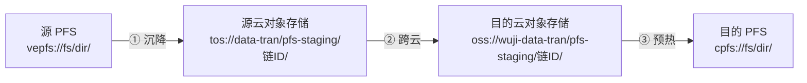
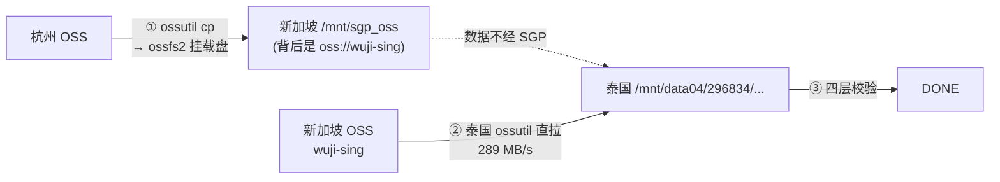
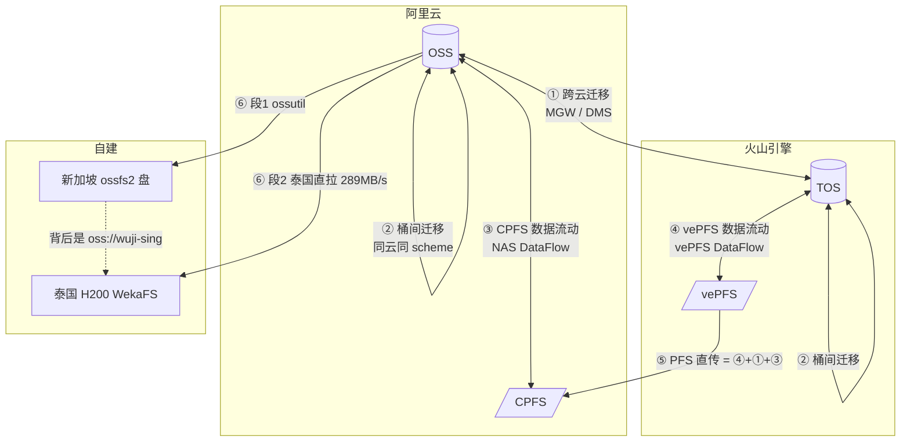

# 数据传输总览 —— 六条搬运链的原理与操作

> 本文以**代码为准**（2026-08-13 逐文件核对），与 `CLAUDE.md` 不一致处以本文为准，差异已在 §7 逐条列出。
> 面向两类读者：要发起一次搬运的运维、要把数据传输抽成独立板块的开发。

---

## 0. 一句话结论

系统里有**六条**互相独立的数据搬运链。它们不是历史包袱堆出来的，而是被**云厂商的物理与 API 约束**逼出来的六种拓扑——没有任何一条能覆盖另一条的场景。六条链共用同一套骨架（三入口 / 状态机 / Redis job / 后台轮询 / 对账兜底 / 单次通知闸门），差异只在「中间那段用什么引擎」。

---

## 1. 选链表：我该走哪条

| 场景 | 链 | 代码 | 拓扑 | 线上状态 |
|---|---|---|---|---|
| 火山 TOS ↔ 阿里 OSS 跨云 | **跨云迁移** | `core/transfer/` | 对象存储 →(迁移服务)→ 对象存储 | ✅ TOS→OSS 真机验过 |
| 同云不同桶（OSS→OSS / TOS→TOS） | **桶间迁移** | `core/bucket_transfer/` | 同上，同账号跨 region/桶 | ✅ 双向真机验过 |
| 阿里 CPFS ↔ OSS 预热/沉降 | **CPFS 数据流动** | `core/cpfs_dataflow/` | NAS DataFlow 单跳 | ✅ 预热/沉降均真机跑通 |
| 火山 vePFS ↔ TOS 预热/沉降 | **vePFS 数据流动** | `core/vepfs_dataflow/` | vePFS DataFlow 单跳 | ✅ 沉降真机跑通 |
| 火山 vePFS ↔ 阿里 CPFS 跨云 | **PFS 直传** | `core/pfs_transfer/` | 三段链（沉降→跨云→预热） | ⚠️ 试跑 3 次，均卡在第①段 |
| 杭州 OSS → 泰国 H200 机房 | **SSH 迁移链** | `core/ssh_transfer/` | 两段链（中转盘→直拉） | ✅ 19.5 TiB 实跑过 |

**三条判据，30 秒定链：**

1. 两端**都是对象存储**？→ 同云走桶间、跨云走跨云迁移。
2. 一端是 **PFS（CPFS/vePFS）另一端是同云对象存储**？→ 该云的数据流动（预热/沉降）。
3. 两端**都是 PFS 且跨云**？→ PFS 直传。**目的地是泰国机房**？→ SSH 迁移链（唯一不走云厂商迁移服务的链）。

---

## 2. 为什么必须是六条

### 2.1 PFS 之间没有直连

两朵云的并行文件系统**物理上互相看不见**。唯一通路是各自的对象存储：

```
源 PFS ──沉降──▶ 源云对象存储 ──跨云迁移──▶ 目的云对象存储 ──预热──▶ 目的 PFS
```

这就是 PFS 直传必然是三段链的原因，也是它复用另外三条链的原因——每一段都已经是一条独立可用的链。

### 2.2 方向决定引擎，这是服务设计而非选择

云厂商的迁移服务都是**目的端拉取**模型：迁移任务建在**目的云**、由目的云来源端读数据。所以：

| 目的地 | 引擎 | 凭证形态 |
|---|---|---|
| 进 **OSS** | 阿里「在线迁移服务」MGW (`alibabacloud_hcs_mgw20240626`) | 目的 OSS 用 **RAM role**（无 AK）；源用静态 AK |
| 进 **TOS** | 火山「迁移服务」DMS (`volcenginesdkdms`) | 两端静态 AK（火山无 STS） |

写代码时不能"挑一个顺手的引擎"——反向就是 API 打不通。

### 2.3 泰国那条为什么不用云迁移服务

泰国 H200 机房是**自建服务器**，不是云厂商的存储服务，没有任何迁移服务能把数据推进去。只能 SSH 遥控。而它为什么是**两段**，是实测逼出来的：

| 路线 | 实测速度 |
|---|---|
| SGP → 泰国 rsync 单流 | 27 MB/s |
| SGP → 泰国 rsync 8 流 | 78 MB/s |
| **泰国 ossutil 直拉新加坡 OSS** | **289 MB/s** |

瓶颈是"SGP 那一跳"本身，不是带宽包（SGP 出口实测上限 768 MB/s）。改成直拉后快 10 倍，且完全不占 SGP 带宽、少一次中转拷贝。

**但段1（杭州→新加坡）不能砍**：杭州出境限速，泰国直拉杭州慢（泰国→杭州 RTT 83ms vs →新加坡 31ms）。中转桶这一跳有价值。

---

## 3. 共用骨架

六条链的编排代码长得几乎一样，这是刻意的——新链只需要换引擎。

### 3.1 三入口

| 入口 | 特点 | 覆盖的链 |
|---|---|---|
| **飞书卡片** | 主入口，向导式，普通人能用 | 全部 6 条 |
| **Agent 工具** | 自然语言调用，`plan`/`apply`/`status` | transfer / cpfs / vepfs / pfs（4 条） |
| **CLI** | `python -m core.<pkg>.cli`，dry-run 默认 | transfer / cpfs / vepfs / pfs / ssh（5 条） |

> **桶间迁移只有飞书卡片一个入口**——既没有 Agent 工具也没有 CLI（`core/bucket_transfer/` 下无 `cli.py`）。

### 3.2 状态机

```
跨云 / 桶间   NEW → CROSSING(RUNNING) → DONE | FAILED
数据流动      NEW → RUNNING → DONE | FAILED
SSH 两段链    NEW → STAGE1 → STAGE2 → DONE | FAILED
PFS 三段链    NEW → SINKING → CROSSING → PREHEATING → DONE | FAILED
```

### 3.3 Redis job 记录

| 链 | key | job 前缀 | TTL |
|---|---|---|---|
| 跨云迁移 | `transfer:job:{id}` | `tr-` | 30 天 |
| 桶间迁移 | `bkt:transfer:job:{id}` | `bkt-` | 30 天 |
| CPFS | `cpfs:dataflow:job:{id}` | `cpfs-` | 30 天 |
| vePFS | `vepfs:dataflow:job:{id}` | `vepfs-` | 30 天 |
| PFS 直传 | `pfs:transfer:job:{id}` | `xpfs-` | 30 天 |
| SSH 链 | `ssh:transfer:job:{id}` | `sgp-` | 30 天 |

**幂等**：`job_id = <前缀> + hash(源, 目的, 当天)[:12]`（五条链用 sha1，桶间迁移用 md5——无实质差异，纯历史）。同一天重复提交同一对路径 → 命中同一个 job，不会起第二个任务。

### 3.4 三重通知保证（重启也不丢结果）

这是整套骨架里最值钱的一块：

1. **在线线程** —— `run_to_completion` 每 60s 轮询，终态推结果卡。
2. **对账兜底** —— `dsw_scheduler._reconcile_dataflow_once()` 每 2 分钟扫全部六个命名空间。轮询线程随容器重启而死，对账线程随容器复活，**接管孤儿 job 继续推进**。只处理 `updated_ts` 超过 **180s** 的（新鲜的说明有活线程在管，交给它，天然错开）。
3. **单次闸门** —— `dataflow:notified:{job_id}` 是 `SET NX`，六条链共用。在线线程、对账线程、文本查询、按钮查询，谁先抢到谁推，**同一个 job 只会收到一张结果卡**。

净效果：**任务无论中途重启几次，跑完都会自动通知，且只通知一次。**

对账规格集中在 `core/dsw_scheduler.py:870 _dataflow_reconcile_specs()`，加新链只需加一个 dict：

```python
{"name": "xxx", "o": orchestrator, "cards": cards,
 "active": {STAGE_...}, "chat": lambda: settings.XXX_CHAT_ID, "cleanup": None}
```

契约：orchestrator 必须有 `_KEY_PREFIX` / `get_job` / `refresh` / `_save` / `STAGE_DONE` / `STAGE_FAILED`，cards 必须有 `result_card`。`refresh` 必须**只轮询、绝不重新提交**（SSH/PFS 两条链是例外：它们的 refresh 会自动推进下一段，这正是"重启后续跑"的期望行为，靠 stale 门 + NX 锁保证不并发双起）。

### 3.5 轮询上限

| 链 | max_polls × 60s | 上限 |
|---|---|---|
| 五条链 | 1440 | 24 小时 |
| **SSH 链** | 10080 | **7 天** |

SSH 链是特例：19.5 TiB 的段1 就要约 38 小时，24h 上限会在任务仍正常运行时误判"轮询超时"。**真失败仍由 rc marker 立刻判定，不依赖这个上限。**

---

## 4. 六条链详解

### 4.1 跨云迁移 `core/transfer/`

**路径语法**（`paths.py`）：`tos://bucket/prefix/` ↔ `oss://bucket/prefix/`，只接受目录（尾斜杠）。目的可省略——按 `TRANSFER_BUCKET_MAP` 推导桶、镜像源前缀。

**TOS→OSS 调用链**（`engine_mgw.py`，一期，已验证）：

```
create_address(源 tos: AK/SK/bucket/prefix/domain)
  → verify_address        ← 最多重试 10 次 × 3s
  → create_address(目的 oss: bucket/region/prefix/role)
  → verify_address
  → create_job(transfer_mode, overwrite_mode)
  → update_job(IMPORT_JOB_LAUNCHING)
  → 轮询 get_job 直到 FINISHED | INTERRUPTED
```

**同名策略的真相**（`orchestrator.py:158-164`）：文档说 `overwrite_mode=never` 能不覆盖，**真机探测发现服务端拒收 never**。实际实现：

| 用户选择 | 实际下发 | 语义 |
|---|---|---|
| 跳过同名（默认） | `transfer_mode=lastmodified` + `overwrite_mode=always` | 增量，同名未变则跳过 |
| 覆盖同名 | `transfer_mode=all` + `overwrite_mode=always` | 全量强制覆盖 |

**⚠️ OSS→TOS 的目标前缀限制（重要，会咬人）**：火山 DMS 1.0 **只能指定目标桶、指不了目标前缀**。对象保持**源 key 结构**落进目的桶：

```
oss://src/team/data/file.txt  ──▶  tos://dst/team/data/file.txt
                                   （不是 tos://dst/你填的前缀/file.txt）
```

要固定 TOS 子目录，只能预先整形源 key，或迁完再在 TOS 侧做一次 copy/rename。

**审批门**：超过 `TRANSFER_APPROVAL_TB`（默认 1 TB）需管理员点确认（`actions.py:551`）。

### 4.2 桶间迁移 `core/bucket_transfer/`

同云一次性搬运，与跨云链**完全独立**（独立卡片/意图/编排/job 命名空间），只**加法式复用**其引擎：

- `oss://→oss://` → `engine_mgw.submit_cross_job(src_scheme="oss")`，新增 `create_oss_source_address`，**源也用 RAM role**
- `tos://→tos://` → `engine_tos.submit_cross_job(src_is_tos=True)`，DMS 源 vendor 切 `StorageVendorTOS` + endpoint `tos-<region>.volces.com`

混合 scheme（oss↔tos）由 `paths.build_plan` 拒绝并提示改用跨云迁移。

**region 怎么来**：OSS 走 `tools/aliyun/oss.detect_bucket_region`（GetBucketLocation）自动探测源和目的，跨 region 时源用公网 domain；TOS 从 `tos://` 地址里带不出 region → 回退 `TRANSFER_TOS_REGION` / `TOS_REGION`。

**火山落盘限制同 §4.1**：DMS 目的只到桶级。

**已验收**：阿里 OSS→OSS（179MB / 30 对象跨 region）+ 火山 TOS→TOS（task 553276，秒级）。火山 DMS 没有阿里那种分钟级 LAUNCHING 排队。

### 4.3 CPFS 数据流动 `core/cpfs_dataflow/`

阿里 NAS DataFlow（product `NAS` / version `2017-06-26` / RPC）。**预热** = `TaskAction=Import`（OSS→CPFS，加载）；**沉降** = `TaskAction=Export`（CPFS→OSS，刷回）。

**不引新 SDK**：走通用 `alibabacloud-tea-openapi` 的 `call_api`（同 `ram_approval._call_ims_api` 的姿态），所以部署不用重建镜像。

**版本自动分支**：`bmcpfs-*` = 智算版（`DataType=MetaAndData`，任务需 `ConflictPolicy`）；`cpfs-*` = 通用版。

**⚠️ 临时 DataFlow：复用优先，临建即删**

CPFS 通用版的 DataFlow 绑在 Fileset 上，**Fileset 里已有数据时建流会清空它并替换为 OSS 侧数据**（见 `docs/aliyun_cpfs_oss_dataflow_api.md`）。这个风险是真实的，所以策略是：

```
start_task
 ├─ resolve_dataflow 找能覆盖该目录的现有绑定（取最长的、是目标祖先的 FileSystemPath）
 │   ├─ 命中 → dataflow_ephemeral=False → 绝不删（那是别人的绑定）
 │   └─ 未命中 → create_dataflow 临建 → dataflow_ephemeral=True
 └─ run_to_completion 末尾 _cleanup_ephemeral()
     无论成功/失败/超时，都只删自己临建的那条
```

`create_dataflow` **只对智算版（`bmcpfs-`）开放**，通用版直接抛错——绝不代人在通用版上建流。

**发现与下拉**（`discovery.py`）：遍历 `CPFS_FILE_SYSTEM_IDS`（`fs_id@region,...`），每个 fs 调 `list_dataflows`，构造 `{region, fs_id, data_flow_id, oss_bucket, oss_prefix, fs_path, label, value}` 选项列表，缓存在 Redis `cpfs:dataflow:map`（6h）。**`cri` 前缀的 OSS 桶被排除**（镜像仓库，不是数据）。飞书卡把这些渲染成下拉，用户选绑定 + 填相对子目录，不用手写全路径。

**路径输入**：用户给完整挂载路径 `/cpfs/cwr/third_party_data/label`，剥掉 `CPFS_MOUNT_PREFIX`（`/cpfs`）得到 DataFlow 的 `FileSystemPath` `/cwr/third_party_data/label`。

**前置**：bot 的 AK 需要 `nas:DescribeDataFlows`（走枚举路时还要 `nas:DescribeFileSystems`）。默认 master AK 只有 RAMReadOnly + STS，可能需要额外授权。

### 4.4 vePFS 数据流动 `core/vepfs_dataflow/`

火山「文件存储 vePFS」数据流动（service `vepfs` / version `2022-01-01`）。阿里 CPFS 那条的火山镜像。

**不引新依赖**：用 `volcenginesdkvepfs.VEPFSApi`——已装的 `volcengine-python-sdk` 巨石包的子包（和 `core/transfer/engine_tos.py` 用的 `volcenginesdkdms` 同一个包）。

**与阿里的关键差异**：火山**没有** `CreateDataFlow` 这种持久绑定对象。`submit_task`（CreateDataFlowTask）直接带上 TOS 桶/前缀 + vePFS `SubPath`/`FilesetId`，方向只由 `TaskAction` 决定、**不反转源/目的字段**。

→ **省掉了阿里那整层 `resolve_dataflow` / 临建临删的逻辑**，而且**双向都能指定路径**（不像跨云 DMS 只到桶级）。

**status 判定**：SDK 里 status 是自由字符串，用子串归类：

```python
_DONE_HINTS = ("success", "finished", "complete", "done")
_FAIL_HINTS = ("unsuccess", "fail", "error", "cancel", "stopped", "abort")
```

（`unsuccess` 排在 `success` 前面判失败，否则会被子串匹配骗过。）

**前置（控制台一次性）**：vePFS 与 TOS 必须同地域；开通 vePFS→TOS 服务访问授权；`ConfigDataFlowBandwidth` 带宽 > 0；vePFS 已建 Fileset/目标目录。

#### 真机反查已定的参数格式（都是拿 400 换来的，别改回去）

| 参数 | 真机结论 | 改错的后果 |
|---|---|---|
| `DataStorage` | **裸桶名**，不带 `tos://` 前缀 | 带前缀 → `InvalidParameter.BucketName` |
| `SubPath` / `DataStoragePath` | 非空时**首尾都要 `/`**（`/a/b/`） | 无首斜杠 / 只有一侧 → `InvalidParameter.*` |
| `DescribeDataFlowTasks` | **必须翻页**，任务不一定在第一页 | 不翻页 → 任务**永远卡 RUNNING**（`653b753`） |
| `FilesetId` | **可选**，给了才传；用 `SubPath` 定位即可 | — |

均在 `cn-shanghai` 实测（`engine_vepfs._data_storage` / `_norm_slash_dir` 的注释里记了出处）。

**实跑记录**：`vepfs-e6c09016e445` 沉降 DONE（2026-07-28），task `task-cnsh601ebf052c8c`
`vepfs-cnsh4bb0c73b50ae:/wuji-il/xiaoxiong/lerobot_datasets/wuji__simbench_mujoco_100hz/` → `tos://wuji-dc-shanghai`。
**预热方向（TOS→vePFS）尚无成功记录**——同一套 `submit_task` 只换 `TaskAction`，风险低，但没跑过就是没跑过。

### 4.5 PFS 直传 `core/pfs_transfer/`

三段链，**零改现有引擎**——完全复用 `vepfs_dataflow` / `transfer` / `bucket_transfer` 的 `run_to_completion`。



**方向由源 scheme 定**：

| 方向 | 代号 | 实际状态 |
|---|---|---|
| `vepfs → cpfs` | P1 | 三段引擎各自真机验过，**整链一次都没跑过** |
| `cpfs → vepfs` | P2 | **试跑 3 次（2026-07-29），全部卡在第①段** |

同云 / 含对象存储 scheme / 方向不匹配 → 一律拒绝。

**P2 那 3 次失败的真相**（Redis 实测，`sink_done`/`cross_done`/`preheat_done` 全为 `False`）：

| job | 子 job（第①段） | 失败原因 |
|---|---|---|
| `xpfs-277c81de833d` | `cpfs-ddd075edcea8` | `PathNotAccessible`（CPFS 目录不存在或不可访问） |
| `xpfs-da3c893f958a` | `cpfs-4aaf1ed929a9` | `PathNotAccessible` |
| `xpfs-cd3a42e7ec7c` | `cpfs-20349f293776` | 任务 Canceled |

三次都**死在第①段的 CPFS 沉降**，压根没走到跨云段。所以：

- 「跨云段 OSS→TOS 未真机验」——**成立**，从没跑到那一步。
- 「P2 未开工」——**不成立**，代码路径通的，是数据侧的目录不可访问（沉降的源目录得真实存在且有数据）。

**段级续跑**：链 job 记 `sink_done` / `cross_done` / `preheat_done` + 三个子 job_id。retry 或容器重启只重跑**未完成的段**，已成功的段直接跳过。

**⚠️ P2 的静默陷阱（已用校验堵住）**：P2 的跨云段是 OSS→TOS 走火山 DMS，而 DMS 指不了目标前缀（§4.1）。所以第③段预热能不能找到数据，完全取决于「源 staging 前缀 == 目的 staging 前缀」这个巧合。一旦两侧配成不同前缀，**前两段会正常成功，第③段静默地去错误位置找数据**——极难排查。`paths.build_plan` 现在会在 P2 方向直接拒绝前缀不一致的配置。

**审批门（两处都收紧）**：

- 卡片 `confirm` + Agent 工具 `apply` **一律需管理员**，不论自报大小（用户自报量可篡改，只用于显示）。
- `_resume_async` 有 **`launched` 守卫**——否则"查询进度"触发的 `refresh` 就能把一个从未确认的任务跑起来，绕过审批门。

**线上配置**（`PFS_STAGING_MAP`）：

```json
{"vepfs://vepfs-cnshef4f4b647664": {"region":"cn-shanghai","tos_bucket":"data-tran","tos_prefix":"pfs-staging"},
 "cpfs://bmcpfs-00000ub3ici1dnniit2i0": {"region":"cn-hangzhou","oss_bucket":"wuji-data-tran","oss_prefix":"pfs-staging"}}
```

**硬约束：每个 PFS 与它的 staging 桶必须同地域**（vePFS↔TOS 同区、CPFS↔OSS 同区）；**只有跨云段②可跨区**。

**预热段的额外前置**：目标目录须落在该 CPFS 上**已有 DataFlow 绑定**的目录之下。绑 `wuji-data-tran` 的三条是 `/wangyuran/`、`/chenrankou/`、`/zch/datasets/`。否则要靠 §4.3 的临建临删，前置更多。

### 4.6 SSH 迁移链 `core/ssh_transfer/`

给泰国 H200 机房送数据。两段：



**执行模型（关键设计）**：起任务 = 一条**短** SSH 命令

```bash
nohup bash -c '<work>; echo $? > rc' > log 2>&1 & echo $! > pid
```

轮询时**只读 `rc` / `kill -0 pid` 这些 marker，从不通过 SSH 读长输出**。原因：paramiko 读大输出会死锁，且容器重启会丢 channel。每个 job 一个工作目录。

rc 语义：段1 只有 `0` 算成功；段2 `0` 与 `24`（源文件传输中消失）都算成功。

**双跳 SSH**：控制面 bot → SGP → 泰国。复用现有 `SGP_SSH_KEY_ENC`，**零新增凭证**——bot 本来没有到泰国的 key，但 SGP 上早已配好免密。数据面泰国↔新加坡 OSS 直连，**不经 SGP**。

> **双跳的内层脚本一律 base64 传递。** bot 拼串 → SGP shell → 泰国 shell 三层解析，手写多层引号必崩（开发时踩了两次：变量被吃掉、`unexpected EOF`）。base64 只含 `A-Za-z0-9+/=`，外层留一层双引号即可。**禁止再手写嵌套引号。**

#### 段1 的 ossfs2 陷阱（血泪）

段1 目的端 `/mnt/sgp_oss` 是 **ossfs2 (FUSE)，只支持顺序写**。ossutil 有两种默认行为违反它：

1. 超过 100 MiB 的对象默认切分片、并发 pwrite 到不同 offset
2. 见到已存在的 `.temp` 会当续传、从非零 offset 写

**实证**（19.527 TiB / 75850 对象那单）：≤100MiB 的 33484 个**全成功**、>100MiB 的 42366 个**全失败**，边界与分片阈值严格吻合；报告里 `invalid argument` 出现 42366 次、其它 Error 0 次。

修复（`engine_ssh.start_stage1`）：

```bash
# 跑前清残留 —— 这是必须的，不是打扫卫生
find <dst> -type f -name '*.temp' -delete

ossutil cp <src> <dst> -r --job 30 --parallel 1 --part-size 5Gi -u --checkpoint-dir <ckpt>
#                          ↑单数flag  ↑压成单分片顺序写
```

- `--parallel 1 --part-size 5Gi` 压成单分片顺序写；跨文件并发 `--job 30` 保留不降。
- **不清 `.temp` 的话，段1 只要被中断过一次（kill / 容器重启 / 网络抖动），之后每一次重试都必然失败。** 单独实测：留着 rc=4（0.6 秒就挂）/ 删掉 rc=0。
- 修复后 200 对象 77.6 GiB 跑出 **148 MiB/s 零 EINVAL**（比出错那次的 75 MiB/s 快一倍）。
- **残留限制**：单个对象 > 5 GiB 压不成单分片，仍会 EINVAL。

#### 段2 的 ossutil flag（已在泰国 2.3.0 上逐个核实，不是猜的）

| flag | 说明 |
|---|---|
| `-j/--job` | **默认仅 3，必须显式给**。`--jobs`（复数）**不存在** |
| `--parallel` | 单对象内并发 |
| `-u/--update` | 跳过「已存在**且比源更新**」；**mtime 相等不跳过**（会重下） |
| `-f` | detached 跑**必须给**，否则交互提示会永久挂住 |
| `--checkpoint-dir` / `-e` / `--region` | 断点 / endpoint / region |

`--job` 从 16 调到 32 只多 2%，已近饱和，**别再往上调**。

`stage_progress` **刻意不返回 pct**：ossutil 在 Scanning 阶段的百分比分母是"已扫到的量"、会虚高，而 `progress_line` 优先用 `job["pct"]` → 会把假百分比钉在卡片上。留 None 让上层用 `bytes_done/bytes_total` 算真值。

#### 引擎分派按 job 记录、不按当前配置

```
job["stage2_mode"] → job["handoff"]["engine"] → 回退 rsync
```

**绝不默认 ossutil**——否则改动前建的所有 job 都会被拿错探针查 marker → 误判"进程异常退出"。任务跑起来后有人改 `SSH_STAGE2_MODE` 同理。

旧的并行 rsync 引擎保留为回滚路径（`SSH_STAGE2_MODE=rsync`）。

#### 四层端到端校验 `verify.py`（段2 报成功后必跑）

> **不采信传输器的「Success」。** 21 TB 迁移最坏的结局不是失败，而是「报成功但少数据」——几个月后训练读到坏文件才发现，那时源可能已经清理了。

| 层 | 检查 | 为什么单独一层 |
|---|---|---|
| **L1** | 源对象是否全部覆盖 | 基础 |
| **L2** | 字节总量（**只统计源 key 集合内**的目的字节） | 目的是共享盘，有别人的文件 |
| **L3** | 逐文件字节 | L1/L2 会被「多一个少一个刚好抵消」骗过，L3 不会 |
| **L4** | 抽样从 OSS 重下 + `cmp` 逐字节 | 字节数对不代表内容对 |

**源清单在 bot 侧列、目的清单在泰国侧列，互不采信对方的汇总数。**

关键设计：

- **fail-closed**：校验不过、或校验本身崩掉，都判 FAILED。「不知道对不对」必须当「不对」。
- **判据是「源的每个对象都在且字节一致」，不是两边数量/总量相等**。目的目录是共享数据盘，有历史文件是正常的；拿数量相等当判据会让正常情况报失败，运维就学会忽略校验结果了——那校验就废了。`extra` 只报不判失败。
- **区分「数据问题」与「校验环境问题」**：样本全取样失败（凭证过期 / `/tmp` 放不下 blob）→ `env_issue=True`，文案写「校验环境问题（非数据不一致）」。都判不通过，但不能让人拿着「数据不一致」去重传 21 TB。
- **并发闸门** `ssh:transfer:verify:{job_id}`（NX, TTL 2h）：一趟校验几分钟到几十分钟、期间不刷 `updated_ts`，180s 后对账就判失联 → 再跑一次；多份 job dict last-write-wins **可能把 FAILED 覆盖成 DONE**（真 fail-open）。抢不到锁 → 保持 STAGE2、不给任何结论。
- 远端清单用 `find -printf '%s\t%P\0'`（NUL 分隔、字节数在前）+ **结尾哨兵 + 查 rc**。`%P\t%s\n` 遇含换行的文件名会错行；丢 rc 则 find 超时会被渲染成「目的端缺 7.5 万个」，运维的合理反应是重传。
- 抽样清单（文件名来自 **OSS 对象 key，外部可控**）走 **base64 + NUL，绝不用 heredoc**：一个内容为结束标记的 key 就能提前终止 heredoc、让后续内容在泰国生产机上被当命令执行。
- **校验结论必须显示在成功卡上**——不显示的话，关掉 `SSH_STAGE2_VERIFY` 后卡片跟以前一模一样，那个开关就成了隐形的 fail-open 后门。

#### 注入面

源桶/前缀/目标子目录全部先过 `paths` 的**严格白名单**：桶名按 OSS 规范正则；每级 `\A[A-Za-z0-9._-]+\Z`，禁 `..`、空格、shell 元字符；尾锚用 `\Z` 而非 `$` 以封住结尾换行。

> `shlex.quote` 在段2 **不构成纵深防御**：值被拼进 `WORK="..."` 这个双引号赋值里，单引号在双引号上下文里只是普通字符，**挡不住 `$(...)`、反引号、`${...}`**。这条链上唯一真实的防线就是 `paths` 白名单。**禁止放宽 `_SEG_RE`。** 要彻底修，把 src/dest/flags 当位置参数传给内层 `bash -s -- "$@"`。

#### 段下发锁

`ssh:transfer:stagelaunch:{job_id}:{stage}`（NX, TTL 180s）。段1 rc 落盘到 `stage=STAGE2` 写回 Redis 之间有最长 60s 窗口，期间任何 `refresh()` 都会再起一次段2。**输家不写 Redis 但回读刷新本地 job dict**——否则调用方那份永远停在旧 stage，7 天后用陈旧对象写 FAILED、覆盖赢家的 DONE。

#### 凭证与主机认证

私钥是 Fernet 密文 `SGP_SSH_KEY_ENC`，运行时解密进内存（**绝不落盘**；解密结果不含 `-----BEGIN` 直接报错）；host key 固定 `SGP_SSH_HOST_KEY` + `RejectPolicy`（**禁 AutoAdd，fail-closed**）。

#### 泰国侧前置（人工一次性）

- 装 `ossutil`（现 2.3.0）+ 配好 `~/.ossutilconfig`（能读 `SGP_OSS_BUCKET`），**权限须 600**（曾是 664，同机其他账号可读 AK/SK）。
- 目标盘挂载点是 `/mnt/data04/296834`（WekaFS，比 `/mnt/data04` 深一层——`df /mnt/data04` 看到的是根分区，会误判容量不足）。
- sshd `MaxStartups` 取默认 `10:30:100` → rsync 回滚路径的并发上限被钉在 10。

#### ⚠️ 未修的已知缺口

`start_stage1` 和 `estimate_source` **都不带 `-e/--endpoint`**，完全依赖 SGP 上写死杭州的 `~/.ossutilconfig` → **源桶不在杭州则段1 必挂**（rc=2，403 `must be addressed using the specified endpoint`）。前一单 `sgp-841b88a7b0dd` 即此。

---

## 5. 操作手册

### 5.1 飞书（主入口）

发一句话触发对应向导卡。**意图判定顺序是有意义的，先命中先赢**（`core/feishu_bot/messages.py:686-731`）：

```
① PFS 直传（须同时提到 vepfs + cpfs）
② SSH 迁移链（泰国 H200）
③ 桶间迁移
④ CPFS/vePFS 预热沉降向导
⑤ 跨云迁移
```

**越通用的话术越靠后**——否则「数据迁移」「迁移」这种词会被前面的入口抢走。

| 想做什么 | 说什么 |
|---|---|
| 跨云迁移 | `迁移 tos://bucket/prefix/`（带路径直接解析预估）或「跨云迁移」（弹录入卡） |
| 桶间迁移 | 「桶间迁移」/「同云迁移」/「桶迁移」 |
| 预热/沉降 | 「预热」/「沉降」/「vepfs沉降」/「火山预热」/「tos沉降」 |
| PFS 直传 | 需**同时**提到 vepfs 和 cpfs |
| 泰国迁移 | 「数据迁移（泰国H200）」 |

统一流程：**录入卡 →（预估 + 审批判断）确认卡 → 后台跑 → 进度卡 → 结果卡**。失败卡上有重试按钮。

### 5.2 查进度

**文本查询**：直接发 `查询进度 <任务ID>`。识别的前缀（`_JOB_ID_RE`）：

```
tr-  cpfs-  vepfs-  sgp-  xpfs-
```

> **`bkt-` 不在其中**——桶间迁移只能点卡片上的「查询进度」按钮查。

文本查询会**重查云端**再回文案；若已到终态，经 `dataflow:notified` 闸门补推一张结果卡。

### 5.3 CLI

```bash
# 跨云迁移
python -m core.transfer.cli plan   tos://bucket/prefix/
python -m core.transfer.cli apply  tos://bucket/prefix/ [dest] --overwrite skip [--force]
python -m core.transfer.cli status tr-xxxxxx

# CPFS 预热/沉降（dry-run 默认）
python -m core.cpfs_dataflow.cli discover [--refresh]
python -m core.cpfs_dataflow.cli list <fs_id>
python -m core.cpfs_dataflow.cli preheat|sink /cpfs/dir/ [oss://bucket/prefix/] [--dry-run]
python -m core.cpfs_dataflow.cli status cpfs-xxxxxx

# vePFS 预热/沉降（dry-run 默认，--apply 才执行）
python -m core.vepfs_dataflow.cli preheat|sink vepfs://fs/dir/ tos://bucket/prefix/ [--apply]

# PFS 直传
python -m core.pfs_transfer.cli plan|apply vepfs://fs/dir/ cpfs://fs/dir/ [--force]

# SSH 迁移链
python -m core.ssh_transfer.cli plan|apply oss://bucket/prefix/ [--dest 子目录] [--force]
python -m core.ssh_transfer.cli status sgp-xxxxxx
```

`--force` = 越过审批阈值。**桶间迁移没有 CLI。**

### 5.4 Agent 工具

| 工具 | action |
|---|---|
| `manage_transfer` | `plan` / `apply` / `status` |
| `manage_cpfs_dataflow` | `discover` / `list` / `preheat` / `sink` / `status` |
| `manage_vepfs_dataflow` | `preheat` / `sink` / `status` |
| `manage_pfs_transfer` | `plan` / `apply` / `status`（apply 需管理员） |

### 5.5 失败了怎么办

1. **看失败卡的明细**。SSH 链的失败卡会带 ossutil 报告路径 + 失败对象条数 + 首条 `cause`。
2. **点「重试」按钮**。重置 stage → NEW；PFS 三段链会**跳过已成功的段**。
3. **rc 语义**：段1 rc=2 通常是 endpoint/权限（403）；rc=4 且几秒就挂，看是不是 `.temp` 残留。
4. **任务"卡住不动"**：先确认不是轮询线程死了——对账线程每 2 分钟会接管超过 180s 没更新的在途 job，等一轮再看。

> ossutil 用 `\r` 刷屏（单次日志可达十几 MB），**必须 `tr '\r' '\n'` 再 grep**，直接 `tail -n` 只能抓到一整行进度条。

---

## 6. 配置总表

### 通用

| 变量 | 默认 | 说明 |
|---|---|---|
| `TRANSFER_BUCKET_MAP` | 见下 | `{"<scheme>://<src-bucket>": "<dst-bucket>"}`，省略目的时按它推导 |
| `TOS_ACCESS_KEY` / `TOS_SECRET_KEY` | — | 火山静态 AK（火山无 STS），vePFS 也复用 |

线上：`{"tos://wuji-egocentric-data":"wuji-bucket-hangzhou","oss://wuji-bucket-hangzhou":"wuji-egocentric-data"}`

### 跨云 / 桶间

| 变量 | 线上值 |
|---|---|
| `MGW_ENDPOINT` / `MGW_REGION` | `cn-beijing.mgw.aliyuncs.com` / `cn-beijing` |
| `MGW_USER_ID` | 已配（主账号 UID） |
| `TRANSFER_OSS_ROLE` | OSS 目的端 RAM 角色 |
| `BUCKET_TRANSFER_OSS_SRC_ROLE` | 阿里源 OSS 读角色，留空回退 `TRANSFER_OSS_ROLE` |
| `TRANSFER_APPROVAL_TB` | `1.0` |

### CPFS / vePFS

| 变量 | 线上值 |
|---|---|
| `CPFS_FILE_SYSTEM_ID` | `bmcpfs-00000ub3ici1dnniit2i0` |
| `CPFS_FILE_SYSTEM_IDS` | `bmcpfs-00000ub3ici1dnniit2i0@cn-hangzhou,bmcpfs-07001v48jdw7tt8jhw0df@ap-southeast-1` |
| `CPFS_REGION` / `CPFS_MOUNT_PREFIX` | `cn-hangzhou` / `/cpfs` |
| `CPFS_APPROVAL_GB` | `500.0` |
| `VEPFS_FILE_SYSTEM_ID` / `VEPFS_REGION` | `vepfs-cnshef4f4b647664` / `cn-shanghai` |

### PFS 直传

`PFS_STAGING_MAP`（见 §4.5）、`PFS_TRANSFER_APPROVAL_TB=1.0`、`PFS_TRANSFER_STAGING_CLEANUP`、`PFS_TRANSFER_CHAT_ID`

### SSH 链

| 变量 | 线上值 | 备注 |
|---|---|---|
| `SGP_SSH_HOST/PORT/USER` | `43.98.203.59:22 root` | |
| `SGP_SSH_KEY_ENC` / `SGP_SSH_HOST_KEY` | Fernet 密文 / 固定 | 缺 KEY_ENC 整条链不可用 |
| `SGP_OSS_MOUNT` / `SGP_OSS_BUCKET` | `/mnt/sgp_oss` / `wuji-sing` | 须与 `/etc/ossfs2_sgp.conf` 的 `oss_bucket` 一致 |
| `SGP_OSSUTIL_JOBS` | `30` | 段1 跨文件并发 |
| `THAI_HOST/PORT/USER` | `203.156.3.194:40002 wuji` | |
| `THAI_DEST_ROOT` | `/mnt/data04/296834/Wuji-Algorithm@wuji.tech/data` | |
| `THAI_OSS_ENDPOINT` / `THAI_OSS_REGION` | `oss-ap-southeast-1.aliyuncs.com` / `ap-southeast-1` | **显式给**，不吃泰国 `~/.ossutilconfig` 的默认值 |
| `THAI_OSSUTIL_JOBS` / `_PARALLEL` | `32` / `8` | |
| `SSH_STAGE2_MODE` | `ossutil` | `rsync` = 回滚 |
| `SSH_STAGE2_VERIFY` / `_SAMPLES` | `true` / `5` | **别关** |
| `SSH_TRANSFER_APPROVAL_TB` | `1.0` | |

> 性能旋钮（`THAI_RSYNC_STREAMS` / `THAI_OSSUTIL_*` / `SSH_STAGE2_VERIFY_SAMPLES`）**刻意存原始字符串、不在 import 期 `int()`**：`.env` 写成空值或非数字会让 `config.settings` 整个 import 失败、**bot 起不来**，而它们只是旋钮。转换与钳位在使用处（非法值退回安全默认）。
>
> SSH 链依赖 `paramiko` → 部署需 `docker compose up -d --build`，不是普通 deploy。

---

## 7. 现状核对（2026-08-13 实测）

### 7.1 六条链的门禁强度**不一致**——这是当前最大的治理缺口

| 链 | 确认下发的门 | 代码 |
|---|---|---|
| PFS 直传 | **一律需管理员**（最严） | `actions.py:1389` |
| 跨云迁移 | 超 `TRANSFER_APPROVAL_TB` 需管理员 | `actions.py:551` |
| SSH 链 | 超阈值需管理员；**估算失败 fail-safe 当作需审批** | `actions.py:1260` |
| CPFS | **无门**（`needs_approval` 有定义但确认 handler 没调） | `actions.py:799` |
| vePFS | **无门**（连 `needs_approval` 都没实现） | `actions.py:936` |
| 桶间迁移 | **无门**（连 `needs_approval` 都没实现） | `actions.py:1135` |

任何人在群里点一下就能发起一次 CPFS 预热 / vePFS 沉降 / 桶间迁移。抽独立板块时这是第一件要统一的事。

### 7.2 六个 `*_ENABLED` 开关，**五个是死的**

```bash
$ grep -rn "TRANSFER_ENABLED|CPFS_DATAFLOW_ENABLED|VEPFS_DATAFLOW_ENABLED" --include=*.py .
core/feishu_bot/messages.py:686:    if settings.PFS_TRANSFER_ENABLED and _is_pfs_transfer_intent(...)
```

**只有 `PFS_TRANSFER_ENABLED` 真的门任何东西。** 另外五个（`TRANSFER_ENABLED` / `BUCKET_TRANSFER_ENABLED` / `CPFS_DATAFLOW_ENABLED` / `VEPFS_DATAFLOW_ENABLED` / `SSH_TRANSFER_ENABLED`）在 `config/settings.py` 里定义了，但**全代码库无人读取**。

线上实际值：

```
TRANSFER_ENABLED=False          ← 但跨云迁移的飞书入口/Agent 工具/CLI 全都能用
BUCKET_TRANSFER_ENABLED=False   ← 同上
CPFS_DATAFLOW_ENABLED=False     ← 同上
VEPFS_DATAFLOW_ENABLED=True
PFS_TRANSFER_ENABLED=True       ← 唯一真生效的
SSH_TRANSFER_ENABLED=True
```

**后果**：以为把某条链关掉了，其实没关。想真正停用某条链，目前只能改代码或撤掉凭证。

### 7.3 与 CLAUDE.md 的差异

| CLAUDE.md 的说法 | 实际 |
|---|---|
| 「SSH 迁移链与同云桶间迁移只有飞书卡片 + CLI 两个入口」 | 桶间迁移**没有 CLI**（`core/bucket_transfer/` 下无 `cli.py`），只有飞书卡片一个入口 |
| 各链 `*_ENABLED` 配置项 | 见 §7.2，五个是死开关 |
| vePFS「待真机验证 4 项：DataStorage 格式 / status 终态串 / IAM 动作名 / FilesetId」 | **四项均已由真机反查定案**（见 §4.4），且有一条沉降 job 跑到 DONE。这条注记已过期 |
| PFS 直传 P2「前置阻塞、未开工」 | 已试跑 3 次，代码路径通，卡在第①段 CPFS 目录不可访问（见 §4.5） |

### 7.4 真实战绩（线上 Redis 实测，2026-08-13）

> Redis job 记录 TTL 30 天，所以**没有记录 ≠ 没验证过**——更早的验收只在 CHANGELOG 里。下表只反映近 30 天窗口。

| 链 | DONE | FAILED | 说明 |
|---|---|---|---|
| 跨云迁移 | **3** | 0 | 全是 `tos→oss`。**`oss→tos` 方向近 30 天无记录** |
| CPFS 数据流动 | **3** | 5 | 预热 ×2 + 沉降 ×1 成功；失败集中在 `PathNotAccessible` 与通用版建流被拒 |
| vePFS 数据流动 | **1** | 0 | 沉降成功；预热方向无记录 |
| SSH 链 | **1** | 3 | 3 次失败全是 `stage1 退出码 2`（§4.6 的 endpoint 缺口） |
| PFS 直传 | 0 | 3 | 全部卡在第①段，见 §4.5 |
| 桶间迁移 | — | — | 近 30 天无记录；双向验收记在 CHANGELOG（OSS→OSS 179MB/30 对象、TOS→TOS task 553276） |

**仍未跑通的**：

| 项 | 影响 |
|---|---|
| PFS 直传整链（P1 / P2 任一方向） | 唯一一条从未端到端成功的链 |
| 跨云 `OSS→TOS` | 二期功能；PFS 直传 P2 的第②段也依赖它 |
| vePFS 预热（TOS→vePFS） | 与已验证的沉降同一个 `submit_task`，只换 `TaskAction`，风险低 |
| SSH 链源桶不在杭州 | **已知必挂**，缺 `-e` endpoint，见 §4.6 |

---

## 8. 如果要抽成独立的「数据传输」板块

好消息：骨架已经收敛得差不多了。六条链已经共用状态机形状、Redis 约定、对账契约、通知闸门。抽板块的工作量主要在**收口**，不在重写。

### 8.1 已经共享的（直接搬）

- 对账契约 `_dataflow_reconcile_specs()`（`dsw_scheduler.py:870`）——加链只加一个 dict
- 通知闸门 `dataflow:notified:{job_id}`——六条链共用一把 NX 锁
- 卡片原语 `tools/feishu/cards.py`；预热/沉降共用向导卡 `core/dataflow_cards.py`
- `run_to_completion(job, on_update, poll_interval, max_polls)` 签名六条链完全一致

### 8.2 该收口的（按优先级）

| # | 事项 | 理由 |
|---|---|---|
| 1 | **统一审批门** | §7.1，三条链完全无门 |
| 2 | **让 `*_ENABLED` 真的生效** | §7.2，五个死开关。这是「以为关了其实没关」的安全隐患 |
| 3 | 抽 `BaseTransferOrchestrator` | 六份 `_key`/`_save`/`get_job`/`_job_id` 逐字重复 |
| 4 | 统一 job 前缀正则 | `_JOB_ID_RE` 漏了 `bkt-`；每加一条链都要记得改这个正则 |
| 5 | 统一 `estimate_source` 返回形 | 三种签名：`(bytes,objects)` / `(bytes,objects,ok)` / `(bytes,ok)` |
| 6 | 补桶间迁移的 CLI + Agent 工具 | 唯一只有一个入口的链 |

### 8.3 抽板块的边界建议

**该进板块的**：`core/{transfer,bucket_transfer,cpfs_dataflow,vepfs_dataflow,pfs_transfer,ssh_transfer}/`、`core/dataflow_cards.py`、`dsw_scheduler` 里的对账循环、`tools/{transfer,cpfs,pfs_transfer}/`、`tools/volcano/vepfs_dataflow.py`。

**不该进的**：`tools/feishu/`（全项目共用）、`utils/aliyun_client_factory.py`（凭证层，凭证发放链也在用）、`core/feishu_bot/`（路由是全局的，板块只暴露 intent 判定 + handler 注册）。

**唯一真正的耦合点**是 `core/feishu_bot/messages.py` 里那段固定顺序的意图判定（§5.1）——顺序错了功能就串。抽板块时建议把它改成**带优先级的注册表**，让每条链自己声明 `priority` 和 `matcher`，而不是靠 `if` 的物理书写顺序。这样加链不用再去读那段注释才知道该插在哪一行。

---

## 附：一图流


